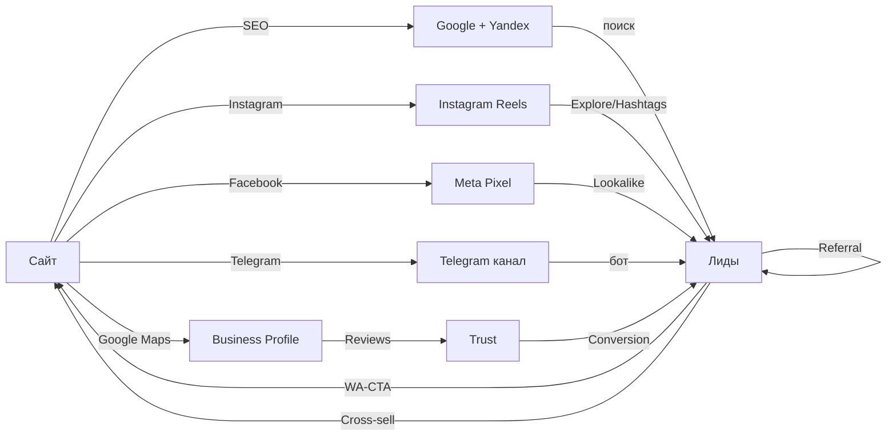
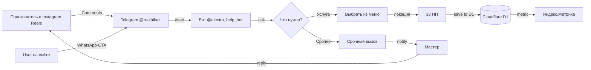
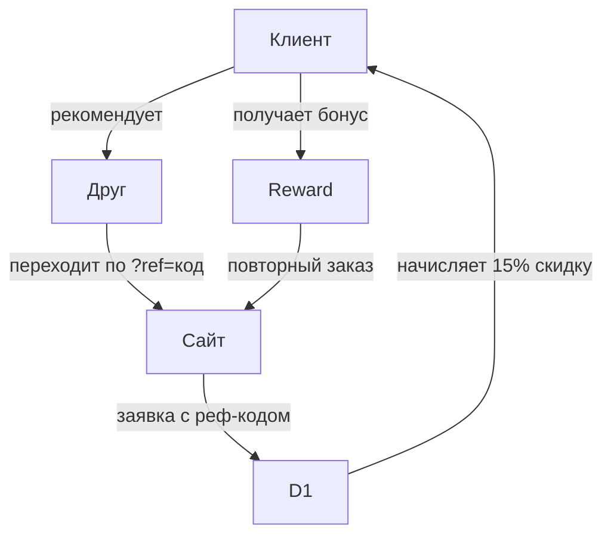

# 📢 MARKETING-LOOPS.md — Соцсети + Yandex.Metrika (v1.2, Кыргызстан)

## 🌍 Контекст рынка Кыргызстан (v1.2)

**Главное отличие от РФ**: Instagram сильно популярен в КР (молодая женская аудитория, владелицы пансионатов, семьи 25-55), Google Ads работает напрямую с локальными клиентами, Meta Ads (Facebook + Instagram) — основная платная машина для B2C.

| Платформа | Приоритет | Аудитория | Действие |
|---|---|---|---|
| **Telegram** | 1 (канал) | B2C + B2B (пансионаты, мастера) 25-45 | Канал @realhikaz + bot-меню с услугами + WA-direct CTA |
| **Instagram** | 2 (приоритет для КР) | B2C женщины 25-55, владелицы пансионатов, семьи | Reels с до/после (5-10/мес) + stories ежедневно + Meta Ads WhatsApp-кнопка |
| **Google Business Profile** | 1 (критически) | Локальный поиск в Чолпон-Ата, туристы | Профиль подтверждён, посты 1/нед, фото работ |
| **Facebook** | 3 (B2B) | Пансионаты, рестораны, отели, диаспора в РФ/Турции/ЕС | Бизнес-страница + группа, B2B-кейсы, видеоотзывы |
| **OK** | 4 | 50+ пенсионеры, владельцы старых домов в сёлах | Длинные тексты + сметы |
| **VK** | 5 (исторически) | Вторичная (Кыргызстан/СНГ) | 1-2/нед |
| **Dzen** | 6 | Длинный контент (статьи) | 2/мес (длинные статьи из блога) |
| **Google Ads** | 1 (платный) | Локальный поиск «электрик [локация]» | 20 000 KGS/мес (см. data/social-platforms.json) |
| **Meta Ads (FB+IG)** | 1 (платный) | B2C ретаргетинг + Lookalike по B2B | 15 000 KGS/мес |
| **Яндекс.Директ** | 2 (платный) | Дублирование Google Ads (но Яндекс — основная метрика) | 20 000 KGS/мес |

## 🌀 Циклы роста (marketing-loops skill)

## 📱 Instagram-контент план (5 Reels/неделю)

Instagram критически важен для КР! Reels получают вирусный охват и приводят тёплых лидов.

| День | Формат | Тема | CTA |
|---|---|---|---|
| Пн | Reels 15с | «До/после: замена проводки в 2-комн. квартире» | WhatsApp |
| Вт | Карусель | «5 признаков что пора менять автоматы» | Подписка |
| Ср | Reels 30с | «Мастер приехал через 25 минут в Бостери» | Direct |
| Чт | Stories | Опрос: «У вас УЗО в щитке?» | Direct |
| Пт | Карусель | «Прайс 2026: от 250 сом за розетку» | Direct |
| Сб | Reels 60с | «Как солёный воздух Иссык-Куля убивает проводку» | Direct |
| Вс | Stories | Отзыв клиента (видео) | Direct |

### Хэштеги для Instagram (чередование 25-30 в посте)

**Брендовые**: #ЭлектрикЧолпонАта #ЭлектрикИссыкКуль #ЭлектрикаЧА #УслугиЧолпонАта

**Локальные**: #ЧолпонАта #ИссыкКуль #Бостери #Тамчы #Каракол #Ананьево #Кыргызстан #Бишкек

**Услуги**: #ЗаменаРозетки #Проводка #Боилер #ЭлектрикНаДом #Пансионат

**Категории Instagram**: 

- @electro_cholpon_ata — основной аккаунт
- @elektrika_issykkul_b2b — B2B (пансионаты)
- @remont_kvartir_kg — ремонт квартир

## 📊 Yandex.Metrika — цели (уже готовы к подключению)

### События для отслеживания (готовы в коде):

| Цель | Триггер | Ценность |
|---|---|---|
| `click_whatsapp` | Клик по wa.me | 1.0 (основная конверсия) |
| `calc_submit` | Клик «Отправить в WhatsApp» в калькуляторе | 5.0 (горячий лид) |
| `subscribe_email` | Submit email-формы | 0.5 |
| `blog_read_85pct` | Скролл 85% | 0.2 |
| `phone_click` | Клик по tel: | 1.5 |
| `geo_page_view` | Просмотр гео | 0.3 |
| `ig_reel_view` | Просмотр Instagram Reel (Cross-Domain) | 0.4 |
| `gbp_directions` | Запрос маршрута в Google Maps | 1.0 |

### Шаги установки Яндекс.Метрики

1. https://metrika.yandex.com → Создать счётчик → 100% данных
2. Скопировать JS-код счётчика → вставить в `src/layouts/Base.astro` перед `</head>` (заменить `XXXXXXXX` на ID)
3. Цели → JavaScript-событие → добавить события из `docs/ANALYTICS-TRACKING.md`
4. Цели → Конверсия → настроить `click_whatsapp` как основную цель
5. Сводка → Сегменты → создать сегмент «Instagram трафик» (UTM `?utm_source=instagram`)
6. Яндекс.Вебмастер → Подтвердить права → sitemap-index.xml

## 🤖 Telegram-бот v2 (webhook + D1)

### Структура бота v2 (готово в roadmap.md §v2)

- Webhook: `https://uslugi-electrica-cholpon-ata-issyk-kol.pages.dev/api/telegram-webhook`
- KV store: user_id → state (awaiting city, service, etc.)
- D1: запросы (id, user_id, username, service, location, phone, status, created_at)
- Уведомления: мастер @realhikaz в Telegram

## 📢 Контент-календарь (обновлённый для КР)

| Платформа | Пн | Вт | Ср | Чт | Пт | Сб | Вс |
|---|---|---|---|---|---|---|---|
| **Instagram** | Reels до/после | Карусель совет | Reels кейс | Stories опрос | Reels прайс | Stories отзыв | Stories бэкстейдж |
| **Telegram** | Совет | Акция | Кейс | Технофакт | Вопрос-ответ | Фотоотчёт | История |
| **Google Business Profile** | - | Пост | - | - | Фото работ | - | - |
| **Facebook** | - | B2B кейс | - | - | Видеоотзыв | - | - |
| **OK** | - | - | - | Длинный пост | - | - | - |
| **VK** | - | - | Пост | - | - | - | - |
| **Dzen** | - | - | - | - | - | Статья | - |

## 🏆 Реферальная программа (referrals skill)

### Структура (для КР важно — сарафанное радио сильное)

- Код: `ELEC-{номер}-{год}` (ELEC-0042-2026)
- Скидка: 15% следующий вызов тому, кто привёл + 5% приведённому
- Распространение: 
  - Telegram-канал (бот рассылает код)
  - Instagram Stories с QR-кодом
  - WhatsApp-сообщение после выполненной работы

## 📊 Бюджет рекламы (data/social-platforms.json)

| Платформа | Бюджет/мес (KGS) | Ожидаемо кликов | Ожидаемо заявок |
|---|---|---|---|
| Google Ads | 20 000 | 200-500 | 10-20 |
| Meta Ads (FB+IG) | 15 000 | 150-300 | 5-15 |
| Яндекс.Директ | 20 000 | 200-400 | 10-20 |
| **Итого** | **55 000** | 550-1200 | 25-55 |

CPA (cost per acquisition) целевой: 1000-2000 KGS при среднем чеке 5000 KGS = 2.5-5x ROI.

## 🛠 Установка Google Ads (v1.3)

1. https://ads.google.com → Создать аккаунт в KGS (оплата через Visa/MC)
2. Кампании:
   - **Брендовая** (поиск "электрик чолпон ата") — KGS 5000
   - **Услуги** (замена розетки, проводка, щит) — KGS 10000
   - **Гео-кампании** (по каждому из 33 НП) — KGS 5000
   - **Ретаргетинг** (посетители /kalkulyator/ без заявки) — KGS 0 (аудитория)
3. Расширения: sitelinks, callout, structured snippets
4. Local-ads: Google Maps интеграция
5. Конверсии: `click_whatsapp` (primary), `phone_click`, `subscribe_email`

## 🛠 Установка Meta Ads (Instagram + Facebook)

1. https://business.facebook.com → Создать Business Manager
2. Связать с Instagram @electro_cholpon_ata
3. Установить Meta Pixel на сайт (в `Base.astro` `<head>`)
4. Кампании:
   - **Reels-промо** (Awareness) — KGS 5000
   - **WhatsApp-кнопка** (Lead) — KGS 5000
   - **Lookalike 1% от клиентов** (Retargeting) — KGS 3000
   - **По интересам** (ремонт домов, пансионаты, услуги) — KGS 2000
5. Формат Reels: 9:16, 15-30с, субтитры, CTA в первые 3с
6. A/B-тест: «до/после» vs «5 признаков проблем с проводкой» vs «мастер в Бостери за 25 мин»

## 🚀 Launch checklist (launch skill)

- [x] Сайт в продакшене
- [x] Документация (ADMIN-GUIDE, BLUEPRINT, roadmap)
- [ ] Яндекс.Метрика подключена (код готов в `docs/ANALYTICS-TRACKING.md`)
- [ ] Яндекс.Вебмастер: sitemap отправлен
- [ ] Google Business Profile: создать и подтвердить (для локального SEO — критически)
- [ ] Instagram @electro_cholpon_ata: создан, 5 Reels опубликовано
- [ ] Meta Pixel: установлен на сайт
- [ ] Meta Ads: 3 кампании запущены (15 000 KGS/мес)
- [ ] Google Ads: 4 кампании запущены (20 000 KGS/мес)
- [ ] Telegram-канал: 5 постов опубликовано
- [ ] Telegram-бот v2: webhook + D1
- [ ] Реферальная программа: код активирован
- [ ] Facebook-страница: 1 пост
- [ ] OK-группа: 1 пост
- [ ] Dzen: первая статья
- [ ] VK: первая публикация

---

*MARKETING-LOOPS v1.2 — обновлён с учётом реалий Кыргызстана (Instagram приоритет #2, Google Ads + Meta Ads параллельно с Яндекс.Директ). Telegram остаётся каналом #1 для прямой связи с клиентами и ботом v2.*
