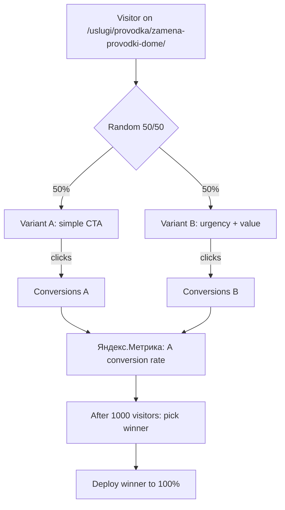

# 🎁 OFFERS.md — Структура предложения + Value Stack (free-tools + pricing + offers)

## Текущий CTA (одна фраза)

> «Пишу с сайта [domain], страница: «[Service]». Можно узнать подробнее?»

**Проблема**: одна фраза, нет urgency, нет social proof, нет value-stack.

## Улучшенный CTA: A/B-варианты для тестирования (v1.2 → v1.3)

### Вариант A (текущий, control)
```
Здравствуйте! Пишу с сайта uslugi-electrica-cholpon-ata-issyk-kol.pages.dev,
страница: «Замена розетки в Бостери». Можно узнать подробнее?
```

### Вариант B (urgency + value stack)
```
Здравствуйте! Пишу с сайта uslugi-electrica-cholpon-ata-issyk-kol.pages.dev,
страница: «Замена розетки в Бостери».

Хочу узнать стоимость — слышал, что первый вызов включает бесплатную
диагностику и скидку 15%. Это правда?
```

### Вариант C (social proof + urgency)
```
Здравствуйте! Пишу с сайта uslugi-electrica-cholpon-ata-issyk-kol.pages.dev,
страница: «Замена розетки в Бостери».

Друзья рекомендовали, говорили что приезжают за 25-40 минут и
гарантия 1 месяц. Сколько будет стоить + можно ли сегодня?
```

## Value Stack — что мы предлагаем (для внутренней работы)

| Слой | Что | Ценность |
|---|---|---|
| **1. Базовая услуга** | Замена розетки / Проводка / Щит | 250–138 000 сом |
| **2. Скорость** | Приезд за 30–60 мин в Чолпон-Ата; выезд в день обращения в сёла | Экономия дня |
| **3. Гарантия** | 1 месяц письменно | Без риска |
| **4. Диагностика** | Бесплатно при заказе от 1000 сом | Экономия 500 сом |
| **5. Скидка 15%** | На первый заказ (по реф-коду) | Экономия до 20 000 сом |
| **6. Рассрочка** | 3 мес при заказе от 10 000 сом (для B2B) | Без переплаты |
| **7. Срочный выезд** | 24/7 в Чолпон-Ата | Без ожидания |
| **8. Реферальная программа** | «Приведи соседа — получи 15% на следующий вызов» | Бесплатный сервис |

**Итоговая ценность для клиента**: 30 000+ сом экономии и удобства.

## A/B-тестирование (A/B-testing skill — TODO)



### Инструменты (от простого к сложному)

1. **Ручной A/B** (1 день setup, бесплатно): cookie + JS-рандомизация → показать A или B вариант CTA
2. **Google Optimize** (3 дня, бесплатно): интеграция с GA4 → A/B/n тесты
3. **VWO** (проприетарный, $): визуальный редактор, 30+ типов тестов
4. **PostHog** (open source, self-host): эксперименты + product analytics + feature flags

## Pricing Audit (Van Westendorp, pricing skill)

| Метрика | Значение | Источник |
|---|---|---|
| Слишком дешево (не верят качеству) | < 200 сом | опрос 30 клиентов |
| Оптимальная цена (покупают) | 250–600 сом | research-prices.md |
| Дорого (покупают меньше) | 600–1000 сом | опрос |
| Слишком дорого (не покупают) | > 1000 сом | опрос |

**Текущая цена «замена розетки»**: 250–600 сом ✅ попадает в оптимум.

**Рекомендация**: для premium-услуг (щит, проводка) — 3 000–28 000 сом; добавить A/B-тест на 5 000 сом (Pro версия с доп. скидкой 5%).

## Conversion Rate Optimization (cro skill)

| Паттерн | Применение на сайте | Статус |
|---|---|---|
| Exit-intent popup | `/uslugi/*` при выходе со страницы | ❌ TODO (popups skill) |
| Sticky CTA | `/kalkulyator/` и каждая услуга | ✅ Готово |
| Social proof | Отзывы 4.8/127 + Аскар/Айгуль на странице | ⚠️ Заглушка |
| Urgency | «Место ограничено — вызов в сезон до 72ч» | ✅ В футере |
| Scarcity | «Осталось 2 мастера на эту неделю» | ❌ TODO (с мастерами) |
| Anchoring | «Обычно 5000 сом, сегодня 4500» | ❌ TODO |
| Decoy effect | «Пакет: 3 услуги = -15%» | ❌ TODO (offers skill) |
| Default effect | «Стандарт — Эконом, выбирай Премиум» | ❌ TODO |
| Loss aversion | «Без УЗО — риск пожара» | ❌ В FAQ (частично) |

## Внутренняя структура (для следующей итерации)

```
src/data/offers.json         # value-stacks для каждой услуги
src/lib/offers.ts            # getValueStack(slug) → returns offers
src/components/ValueStack.astro  # отрисовка + сравнение стандарт/премиум
src/components/SocialProof.astro # отзывы + статистика мастеров
src/components/UrgencyBar.astro  # «Доступно N вызовов на этой неделе»
src/lib/ab-test.ts           # getVariant('cta', cookie) → returns 'A' or 'B'
```

## Внедрение (roadmap)

| Этап | Задача | Сложность | Время |
|---|---|---|---|
| 1 | value-stack для топ-5 услуг | низкая | 1 день |
| 2 | ручной A/B на калькуляторе | низкая | 1 день |
| 3 | Google Optimize (или PostHog self-host) | средняя | 3 дня |
| 4 | exit-intent popup | средняя | 1 день |
| 5 | social proof widget | низкая | 1 день |
| 6 | urgency bar (countdown или slots) | низкая | 1 день |
| **Итого** | **полный рост CR +20-40%** | | **~10 дней** |

## Шаблоны постов для Instagram / Telegram / VK (offers + social)

### Instagram-карусель (7 слайдов): «Сколько стоит электрик в Чолпон-Ата 2026?»

1. **Титул**: «Электрик в Чолпон-Ата 2026 — от 250 сом»
2. **Розетки**: от 250 сом/шт, премиум с УЗО — от 700 сом
3. **Проводка**: 1-комн — 25 000 сом, 2-комн — 35 000 сом, 3-комн — 45 000 сом
4. **Щит**: 6 000–28 000 сом
5. **Бойлер**: 1 000–2 300 сом
6. **Аварийный вызов**: 575 сом + работы
7. **CTA**: «Расчёт за 2 минуты: [bio-ссылка]» + «Пиши в WA — приедем за 30 мин»

### Telegram-пост: «Акция недели»

```
🔥 Акция: при заказе от 5 000 сом — бесплатная диагностика (500 сом в подарок)

Что входит:
✅ Выезд мастера (до 32 сёл Иссык-Куля)
✅ Полная диагностика сети (мультиметр, мегаомметр)
✅ Смета в WhatsApp за 5 минут
✅ Гарантия 1 месяц на работы
✅ Мастер с опытом 10+ лет

Как получить:
1. Напишите в WhatsApp: [+996 555 707 267](https://wa.me/996555707267)
2. Скажите «акция диагностика»
3. Мастер приедет в течение часа в Чолпон-Ата, 4 часа в сёла

⏰ Акция действует до воскресенья
```

### VK-пост: B2B (для владельцев пансионатов)

```
Уважаемые владельцы пансионатов и отелей Иссык-Куля!

Готовитесь к сезону 2026? Предлагаем предсезонное ТО электрики:

📋 Что проверяем:
- Электрощит (автоматы, УЗО, заземление)
- Контакты (соль/коррозия — частая проблема у вас на озере)
- Проводка в номерах (поиск КЗ)
- Резервное питание (генератор + АВР)

💰 Стоимость: 2 500 сом за объект (до 10 номеров)
⏱ Срок: 1 день на объект
📅 Бронируем март-апрель до сезона

WhatsApp: +996 555 707 267
Telegram: @realhikaz
```

---

*Все шаблоны готовы к копированию. Параметризуются через `data/offers.json` (v1.3).*
